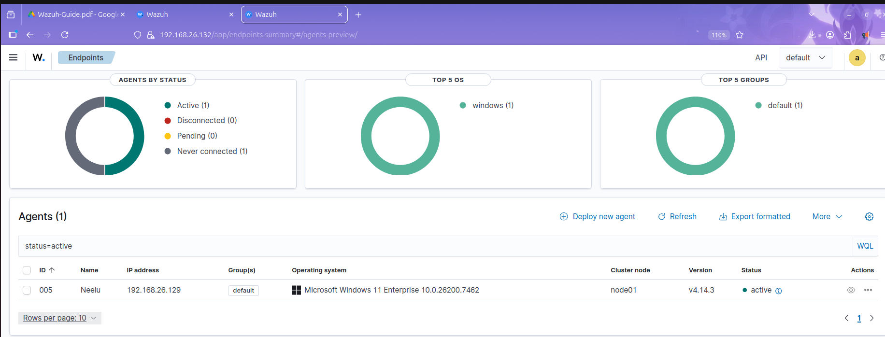
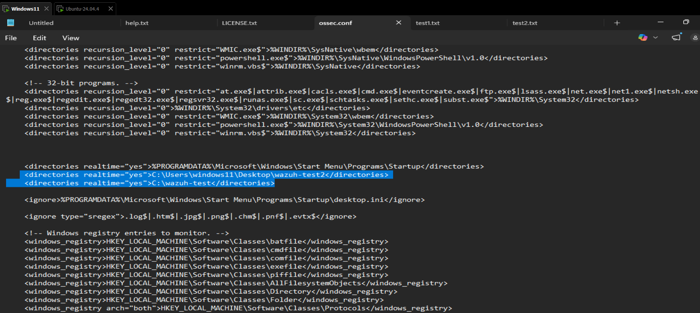
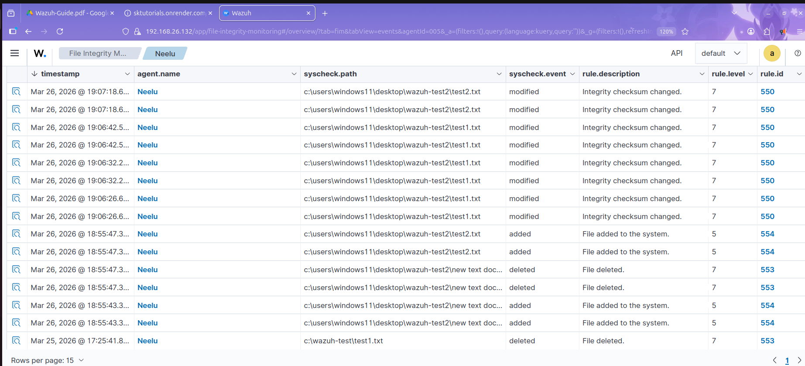

# Wazuh File Integrity Monitoring Project

## Project Overview
This project demonstrates a **File Integrity Monitoring (FIM)** lab using **Wazuh** in a virtualized environment.

### Lab Setup
- **Host Machine**: Windows
- **Virtualization Platform**: VMware Workstation
- **Wazuh Manager**: Ubuntu virtual machine
- **Wazuh Agent**: Windows host machine

### Project Goal
The goal of this project was to:
1. Install and configure Wazuh Manager on Ubuntu.
2. Enroll the Windows machine as a Wazuh Agent.
3. Enable File Integrity Monitoring on a Windows folder.
4. Test real-time file change detection.
5. Document the project for GitHub and LinkedIn.

---

## 1. Lab Roles

### Wazuh Manager — Ubuntu VM
- Collects logs from agents
- Analyzes security events
- Stores alerts and event data
- Displays results in the Wazuh dashboard

### Wazuh Agent — Windows Host
- Sends logs and system events to the manager
- Monitors configured directories
- Reports file changes to Wazuh in real time

---

## 2. Network Configuration

### Bridged Adapter Setup
I used **Bridged Adapter** in VMware Workstation for the Ubuntu VM.

### Why Bridged Mode Was Used
- Places the Ubuntu VM on the same network as the host
- Allows direct communication between the Windows host and Ubuntu VM
- Makes dashboard access and agent communication easier

### Validation
After setting the network mode:
1. Start the Ubuntu VM.
2. Check the IP address using:
```bash
ifconfig
```
or
```bash
ip a
```
3. Confirm the Windows host can reach the Ubuntu VM using ping.

---

## 3. Wazuh Manager Installation on Ubuntu

### Step 1: Update the system
```bash
sudo apt update && sudo apt upgrade -y
```

### Step 2: Add the Wazuh GPG key
```bash
curl -s https://packages.wazuh.com/key/GPG-KEY-WAZUH | sudo gpg --dearmor -o /usr/share/keyrings/wazuh-archive-keyring.gpg
```

### Step 3: Download the Wazuh installation script
```bash
curl -sO https://packages.wazuh.com/4.12/wazuh-install.sh
```

### Step 4: Run the installer
```bash
sudo bash ./wazuh-install.sh -a -i
```

### What this does
- `-a` installs all required components
- `-i` runs the installer in interactive mode

The script installs and configures:
- Wazuh Manager
- Wazuh Indexer
- Wazuh Dashboard

### Step 5: Save the login details
At the end of the installation, the script shows the username and password for the Wazuh dashboard. Save these credentials securely.

---

## 4. Accessing the Wazuh Dashboard

### Step 1: Find the Ubuntu IP address
```bash
ifconfig
```

### Step 2: Open the browser from the Windows host
Go to:
```text
https://<ubuntu-vm-ip>
```

### Step 3: Accept the browser warning
The dashboard uses a self-signed certificate, so the browser may show a security warning. Proceed and continue.

### Step 4: Log in
Use the credentials generated during the installation.

---

## 5. Installing the Wazuh Agent on Windows

### Step 1: Download the Windows agent
Download the latest Wazuh Agent MSI package from the official Wazuh documentation.

### Step 2: Install the agent
Run the MSI installer on the Windows host and complete the installation with default settings.

### Step 3: Open the Agent Manager
After installation, open the Wazuh Agent Manager from the Start Menu.

---

## 6. Enroll the Windows Agent with the Ubuntu Manager

### Step 1: Open the agent management tool on Ubuntu
Run:
```bash
sudo /var/ossec/bin/manage_agents
```

### Step 2: Add a new agent
Inside the menu:
- Press `A` to add an agent
- Enter a name such as `WindowsHost`
- Leave the IP address blank unless you want to bind it to a static IP

### Step 3: Extract the key
- Press `E` to extract the key
- Copy the key output carefully

### Step 4: Paste the key into the Windows agent
In the Windows Agent Manager:
- Paste the copied key
- Enter the Wazuh Manager IP address
- Save the settings

### Step 5: Restart the agent service
Restart the Wazuh Agent service on Windows.

### Step 6: Confirm onboarding
Go to the Wazuh dashboard and verify that the Windows agent appears as onboarded and active.



---


## 7. File Integrity Monitoring on Windows

Wazuh supports real-time file and folder monitoring using **Syscheck**.

### Step 1: Open the agent configuration file
Open:
```text
C:\Program Files (x86)\ossec-agent\ossec.conf
```

### Step 2: Add the monitored directory
Inside the `<syscheck>` or directory configuration block, add:

```xml
<directories realtime="yes">C:\Users\abc\Test</directories>
```

### What this does
This configuration monitors the folder `C:\Users\abc\Test` in real time and detects:
- File creation
- File modification
- File deletion
- Permission changes

### Step 3: Save the file
Save the `ossec.conf` file after making the change.



### Step 4: Restart the agent service
Restart the Wazuh Agent service on Windows so the new configuration takes effect.

---

## 8. Testing the FIM Setup

### Step 1: Create a test file
Create a file inside:
```text
C:\Users\abc\Test
```

### Step 2: Modify the file
Open the file, change the content, and save it.

### Step 3: Delete the file
Delete the file after testing modification.

### Step 4: Check the dashboard
Open the Wazuh dashboard and verify that alerts are generated for:
- File creation
- File modification
- File deletion

Shows file creation, modification, and deletion events on Windows, highlighting OS behavior differences.


### Step 5: Review alert details
Check the event details such as:
- File path
- Timestamp
- Agent name
- Rule triggered
- Event type


---


